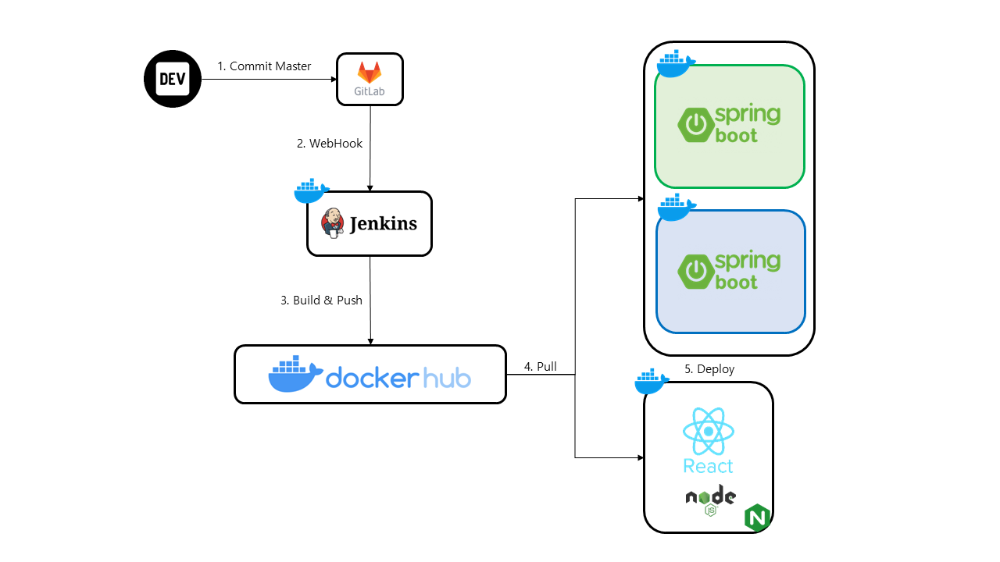
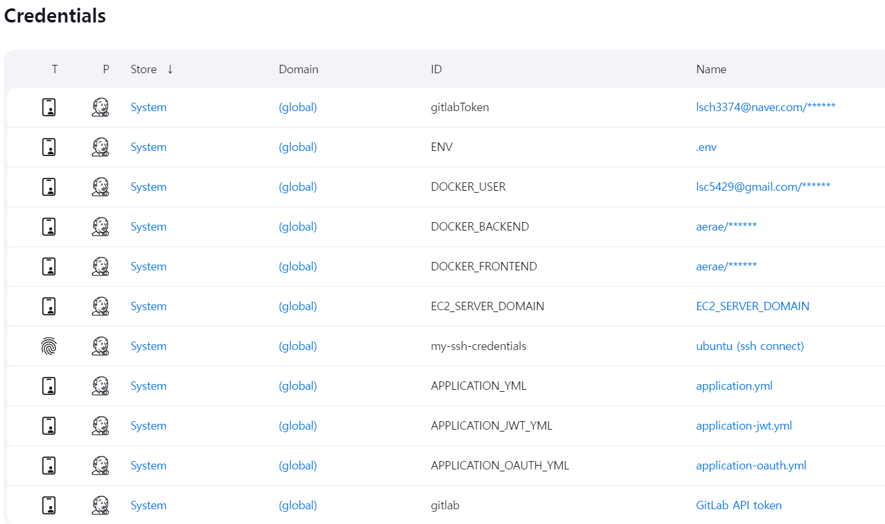

# 포팅 매뉴얼

---

# 기술 스택 버전

### 프론트엔드

- React 18.3.1
- Node.js 20.15.0
- Axios 1.7.2
- Redux 9.1.2
- Tailwindcss 3.4.6

### 백엔드

- Spring Boot 3.3.2
- Java Open JDK 17 - LTS

### DB

- MySQL 9.0.1
- Redis 7.4.0
- MongoDB 7.0.12

### 인프라

- Ubuntu 20.04.6 LTS
- Docker 27.1.1
- Docker-compose 1.25.0
- Jenkins 2.470
- Nginx 1.18.0
- AWS EC2
- AWS S3

---

## CI/CD



---

## 아키텍처


---

## ERD


---

# 배포 과정

---

## Java

```bash
# 업데이트
sudo apt update

# 업그레이드
sudo apt upgrade

# jdk17 설치
sudo apt install openjdk-17-jdk

# 설치 및 버전 확인
java --version
```

---

## Docker

```bash
# 의존성 설치
sudo apt update
sudo apt install ca-certificates curl gnupg lsb-release

# 레포지토리
sudo mkdir -p /etc/apt/keyrings
sudo curl -fsSL https://download.docker.com/linux/debian/gpg | sudo gpg --dearmor -o /etc/apt/keyrings/docker.gpg

# 레포지토리 추가
echo "deb [arch=$(dpkg --print-architecture) \
signed-by=/etc/apt/keyrings/docker.gpg] https://download.docker.com/linux/ubuntu \
$(. /etc/os-release && echo "$VERSION_CODENAME") stable" | sudo tee /etc/apt/sources.list.d/docker.list > /dev/null

# 도커, 도커 컴포즈 설치
sudo apt update
sudo apt install docker-ce docker-ce-cli containerd.io docker-compose-plugin
sudo apt install docker-compose
```

---

## OpenVidu

```bash
# 설치 권장 폴더로 이동
cd /opt

# openvidu 설치
surl https://s3-eu-west-1.amazonaws.com/aws.openvidu.io/install_openvidu_latest.sh | bashDocker

# openvidu 폴더 이동
cd openvidu

# openvidu 설정
vi .env

DOMAIN_OR_PUBLIC_IP=i11b106.p.ssafy.io
OPENVIDU_SECRET=[비밀번호]
CERTIFICATE_TYPE=letsencrypt
LETSENCRYPT_EMAIL=[이메일]
HTTP_PORT=880
HTTPS_PORT=8443

# openvidu 시작
./openvidu start

# openvidu nginx 설정
docker exec -it openvidu-nginx-1 /bin/bash
```

- /etc/nginx/conf.d/default.conf
    
    ```bash
    # Your App
    upstream yourapp {
        server localhost:5442;
    }
    
    upstream openviduserver {
        server localhost:5443;
    }
    
    server {
        listen 880;
        listen [::]:880;
        server_name i11b106.p.ssafy.io;
    
        # Redirect to https
        location / {
            rewrite ^(.*) https://i11b106.p.ssafy.io:8443$1 permanent;
        }
    
        # letsencrypt
        location /.well-known/acme-challenge/ {
            root /var/www/certbot;
        }
    
        location /nginx_status {
            stub_status;
            allow 127.0.0.1;        #only allow requests from localhost
            deny all;               #deny all other hosts
        }
    }
    
    server {
        listen 8443 ssl;
        listen [::]:8443 ssl;
        server_name i11b106.p.ssafy.io;
    
        # SSL Config
        ssl_certificate         /etc/letsencrypt/live/i11b106.p.ssafy.io/fullchain.pem;
        ssl_certificate_key     /etc/letsencrypt/live/i11b106.p.ssafy.io/privkey.pem;
        ssl_trusted_certificate /etc/letsencrypt/live/i11b106.p.ssafy.io/fullchain.pem;
    
        ssl_session_cache shared:SSL:50m;
        ssl_session_timeout 5m;
        ssl_stapling on;
        ssl_stapling_verify on;
    
        ssl_protocols TLSv1.2 TLSv1.3;
        ssl_ciphers "ECDHE-ECDSA-AES128-GCM-SHA256:ECDHE-RSA-AES128-GCM-SHA256:ECDHE-ECDSA-AES256-GCM-SHA384:ECDHE-RSA-AES256-GCM-SHA384:ECDHE-ECDSA-CHACHA20-POLY1305:ECDHE-RSA-CHACHA20-POLY1305:DHE-RSA-AES128-GCM-SHA256:DHE-RSA-AES256-GCM-SHA384";
        ssl_prefer_server_ciphers off;
    
        add_header Strict-Transport-Security "max-age=63072000" always;
    
        # Proxy
        proxy_set_header Host $host;
        proxy_set_header X-Real-IP $remote_addr;
        proxy_set_header X-Forwarded-For $proxy_add_x_forwarded_for;
        proxy_set_header X-Forwarded-Proto $scheme;
        proxy_set_header X-Forwarded-Proto https;
        proxy_headers_hash_bucket_size 512;
        proxy_redirect off;
    
        # Websockets
        proxy_http_version 1.1;
        proxy_set_header Upgrade $http_upgrade;
        proxy_set_header Connection "upgrade";
    
        # Your App
        location / {
            proxy_pass http://yourapp; # Openvidu call by default
        }
    
        ########################
        # OpenVidu Locations   #
        ########################
        #################################
        # Common rules CE              #
        #################################
        # Dashboard rule
        location /dashboard {
            allow all;
            deny all;
            proxy_pass http://openviduserver;
        }
    
        # Websocket rule
        location ~ /openvidu$ {
            proxy_pass http://openviduserver;
        }
    
        #################################
        # New API                       #
        #################################
        location /openvidu/layouts {
            rewrite ^/openvidu/layouts/(.*)$ /custom-layout/$1 break;
            root /opt/openvidu;
        }
    
        location /openvidu/recordings {
            proxy_pass http://openviduserver;
        }
    
        location /openvidu/api {
            allow all;
            deny all;
            proxy_pass http://openviduserver;
        }
    
        location /openvidu/info {
            allow all;
            deny all;
            proxy_pass http://openviduserver;
        }
    
        location /openvidu/accept-certificate {
            proxy_pass http://openviduserver;
        }
    
        location /openvidu/cdr {
            allow all;
            deny all;
            proxy_pass http://openviduserver;
        }
    
        #################################
        # LetsEncrypt                   #
        #################################
        location /.well-known/acme-challenge {
            root /var/www/certbot;
            try_files $uri $uri/ =404;
        }
    
    }
    
    ```
    

---

## Jenkins

```bash
# 도커 소켓 마운트 하기 (젠킨스 컨테이너에서 도커 명령어 실행되도록 하기)
docker run -itd --name jenkins -p 9090:8080 -v /var/run/docker.sock:/var/run/docker.sock -v /usr/bin/docker:/usr/bin/docker jenkins/jenkins:jdk21

# 도커 명령어가 젠킨스에서 실행이 안되거나 권한 오류가 나면 아래 명령어 실행
sudo chmod 666 /var/run/docker.sock

# 젠킨스 컨테이너 비밀번호 확인 명령어
docker exec jenkins cat /var/jenkins_home/secrets/initialAdminPassword

# 젠킨스 컨테이너로 접속해서 도커 명령어 실행 여부 확인 명령어
docker exec -it <container_name_or_id> /bin/bash
docker exec -it jenkins /bin/bash

# 젠킨스 컨테이너에 접속해서 Docker 명령어 되는지 확인
docker
```

### Plugins

- gitLab
- ssh agent
- node.js

### Credentials



---

### GitLab Webhook

- URL: http://i11b106.p.ssafy.io:9090/project/[pipeline이름]
- Secret token: Jenkins pipeline ⇒ General ⇒ Build Triggers ⇒ 고급 ⇒ Secret token
- Trigger: Push events ⇒ Wildcard pattern: master

### Tools

- NodeJS installations
    - Name: nodejs
    - Install automatically: check
    - Version: NodeJS 20.15.0
    - Global npm packages to install: npm@10.7.0

### Pipeline

- Back
    
    ```bash
    pipeline {
        agent any
        
        stages {
            stage('Git Clone') {
                steps {
                    git branch: 'master', credentialsId: 'gitlabToken', url: 'https://lab.ssafy.com/s11-webmobile1-sub2/S11P12B106'
                    sh 'git sparse-checkout init --cone'
                    sh 'git sparse-checkout set BE'
                    sh 'git read-tree -mu HEAD'
                }
                post {
                    failure {
                        echo 'Repository clone failure !'
                    }
                    success {
                        echo 'Repository clone success !'
                    }
                }
            }
            stage('Prepare Directory') {
                steps {
                    sh 'mkdir -p /var/jenkins_home/workspace/MasterBack/BE/pet-bridge/src/main/resources'
                }
            }
            stage('Copy Config') {
                steps {
                    withCredentials([file(credentialsId: 'APPLICATION_YML', variable: 'APP_YML')]) {
                        sh 'rm -f BE/pet-bridge/src/main/resources/application.yml'
                        sh 'cp $APP_YML BE/pet-bridge/src/main/resources/application.yml'
                    }
                    withCredentials([file(credentialsId: 'APPLICATION_JWT_YML', variable: 'APP_JWT_YML')]) {
                        sh 'rm -f BE/pet-bridge/src/main/resources/application-jwt.yml'
                        sh 'cp $APP_JWT_YML BE/pet-bridge/src/main/resources/application-jwt.yml'
                    }
                    withCredentials([file(credentialsId: 'APPLICATION_OAUTH_YML', variable: 'APP_OAUTH_YML')]) {
                        sh 'rm -f BE/pet-bridge/src/main/resources/application-oauth.yml'
                        sh 'cp $APP_OAUTH_YML BE/pet-bridge/src/main/resources/application-oauth.yml'
                    }
                }
            }
            stage('Build') {
                steps {
                    sh 'chmod +x BE/pet-bridge/gradlew'
                    sh 'cd BE/pet-bridge && ./gradlew clean build'
                }
            }
            stage('Docker Build and Push') {
                steps {
                    withCredentials([usernamePassword(credentialsId: 'DOCKER_USER', passwordVariable: 'DOCKER_PASSWORD', usernameVariable: 'DOCKER_USERNAME')]) {
                        sh 'echo "$DOCKER_PASSWORD" | docker login -u $DOCKER_USERNAME --password-stdin'
                    }
                    withCredentials([usernamePassword(credentialsId: 'DOCKER_BACKEND', passwordVariable: 'DOCKER_PROJECT', usernameVariable: 'DOCKER_REPO')]) {
                        sh 'cd BE/pet-bridge && docker build -t $DOCKER_REPO/$DOCKER_PROJECT .'
                        sh 'cd BE/pet-bridge && docker push $DOCKER_REPO/$DOCKER_PROJECT'
                        echo 'docker push Success!!'
                    }
                }
            }
            stage('Deploy') {
                steps {
                    sshagent(credentials: ['my-ssh-credentials']) {
                        withCredentials([string(credentialsId: 'EC2_SERVER_DOMAIN', variable: 'DOMAIN')]) {
                            sh "ssh -o StrictHostKeyChecking=no ubuntu@$DOMAIN 'sudo sh deploy.sh'"   
                        }
                    }
                }
            }
        }
    }
    
    ```
    
- Front
    
    ```bash
    pipeline {
        agent any
    
        tools {
            nodejs 'nodejs'
        }
    
        stages {
            stage('Git Clone') {
                steps {
                    git branch: 'master', credentialsId: 'gitlabToken', url: 'https://lab.ssafy.com/s11-webmobile1-sub2/S11P12B106'
                    sh 'git sparse-checkout init --cone'
                    sh 'git sparse-checkout set FE'
                    sh 'git read-tree -mu HEAD'
                }
                post {
                    failure {
                        echo 'Repository clone failure !'
                    }
                    success {
                        echo 'Repository clone success !'
                    }
                }
            }
            stage('Copy Config') {
                steps {
                    withCredentials([file(credentialsId: 'ENV', variable: 'ENV')]) {
                        sh 'rm -f FE/pet-bridge/.env'
                        sh 'cp $ENV FE/pet-bridge/.env'
                    }
                }
            }
            stage('Cleanup') {
                steps {
                    sh 'rm -f FE/pet-bridge/front_0.1.0.tar'
                    echo 'Cleanup success !'
                }
            }
            stage('Build Docker Image') {
                steps {
                    dir('FE/pet-bridge') {
                        script {
                            sh 'docker build -t react-app .'
                        }
                    }
                    echo 'Docker Image Build success !'
                }
            }
            stage('Docker Build and Push') {
                steps {
                    withCredentials([usernamePassword(credentialsId: 'DOCKER_USER', passwordVariable: 'DOCKER_PASSWORD', usernameVariable: 'DOCKER_USERNAME')]) {
                        sh 'echo "$DOCKER_PASSWORD" | docker login -u $DOCKER_USERNAME --password-stdin'
                    }
                    withCredentials([usernamePassword(credentialsId: 'DOCKER_FRONTEND', passwordVariable: 'DOCKER_PROJECT', usernameVariable: 'DOCKER_REPO')]) {
                        sh 'docker tag react-app $DOCKER_REPO/$DOCKER_PROJECT:latest'
                        sh 'docker push $DOCKER_REPO/$DOCKER_PROJECT:latest'
                        echo 'Docker push Success!!'
                    }
                }
            }
            stage('Deploy') {
                steps {
                    withCredentials([usernamePassword(credentialsId: 'DOCKER_FRONTEND', passwordVariable: 'DOCKER_PROJECT', usernameVariable: 'DOCKER_REPO')]) {
                        sshagent(credentials: ['my-ssh-credentials']) {
                            withCredentials([string(credentialsId: 'EC2_SERVER_DOMAIN', variable: 'DOMAIN')]) {
                                script {
                                    sh 'ssh -o StrictHostKeyChecking=no ubuntu@$DOMAIN uptime'
                                    sh 'ssh -o StrictHostKeyChecking=no ubuntu@$DOMAIN docker-compose -f /home/ubuntu/docker-compose.react.yml stop'
                                    sh 'ssh -o StrictHostKeyChecking=no ubuntu@$DOMAIN docker-compose -f /home/ubuntu/docker-compose.react.yml rm -f'
                                    sh 'ssh -o StrictHostKeyChecking=no ubuntu@$DOMAIN docker-compose -f /home/ubuntu/docker-compose.react.yml pull'
                                    sh 'ssh -o StrictHostKeyChecking=no ubuntu@$DOMAIN docker-compose -f /home/ubuntu/docker-compose.react.yml up -d'
                                }
                            }
                        }
                    }
                    timeout(time: 30, unit: 'SECONDS') {
                        echo 'Timeout reached'
                    }
                    echo 'Deploy success !'
                }
            }
        }
    }
    
    ```
    

---

## SSL

```bash
# Encrypt 설치
sudo apt-get install letsencrypt

# Certbot 설치
sudo apt-get install cerbot python3-certbot-nginx

# Certbot 동작(nginx 중지하고 해야함)
sudo certot --nginx -d i11b106.p.ssafy.io
# 강제 리다이렉트 설정 부분에서 1번 선택
```

---

## Nginx(host)

```bash
sudo apt update
sudo apt upgrade
sudo apt install nginx
sudo service nginx start
sudo service nginx status
```

- /etc/nginx/sites-available/petbridge
    
    ```bash
    server {
        listen 80 default_server;
        listen [::]:80 default_server;
    
        server_name i11b106.p.ssafy.io;
    
        return 301 https://$host$request_uri;
    }
    
    server {
        listen 443 ssl;
        listen [::]:443 ssl;
    
        server_name i11b106.p.ssafy.io;
    
        ssl_certificate /etc/letsencrypt/live/i11b106.p.ssafy.io/fullchain.pem;
        ssl_certificate_key /etc/letsencrypt/live/i11b106.p.ssafy.io/privkey.pem;
        include /etc/letsencrypt/options-ssl-nginx.conf;
        ssl_dhparam /etc/letsencrypt/ssl-dhparams.pem;
        include /etc/nginx/conf.d/service-url.inc;
    
        client_max_body_size 30M;
    
        location / {
            proxy_pass http://172.19.0.5/;
            proxy_set_header Host $host;
            proxy_set_header X-Real-IP $remote_addr;
            proxy_set_header X-Forwarded-For $proxy_add_x_forwarded_for;
            proxy_set_header X-Forwarded-Proto $scheme;
            proxy_http_version 1.1;
            proxy_set_header Upgrade $http_upgrade;
            proxy_set_header Connection "upgrade";
        }
    
        location /api/ {
            proxy_pass $service_url;
            proxy_set_header Host $host;
            proxy_set_header X-Real-IP $remote_addr;
            proxy_set_header X-Forwarded-For $proxy_add_x_forwarded_for;
            proxy_set_header X-Forwarded-Proto $scheme;
            proxy_http_version 1.1;
            proxy_set_header Upgrade $http_upgrade;
            proxy_set_header Connection "upgrade";
        }
    }
    ```
    
    ```
    # sites-enabled로 복사
    sudo ln -s /etc/nginx/sites-available/petbridge /etc/nginx/sites-enabled/
    ```
    
- /etc/nginx/conf.d/service-url.inc
    
    ```bash
    set $service_url http://127.0.0.1:808*;
    
    # 808*: 8081, 8082 번갈아가며 자동 변경됨
    ```
    

---

## Dockerfile & default.conf

- Dockerfile(In BE Project)
    
    ```docker
    # 빌드 단계
    FROM gradle:8.8-jdk17 AS build
    
    # 작업 디렉토리 설정
    WORKDIR /app
    
    # Gradle 빌드 파일과 소스 파일을 복사
    COPY build.gradle settings.gradle ./
    COPY src ./src
    
    # 종속성을 다운로드하고 빌드를 실행
    RUN gradle clean build --no-daemon
    
    # 배포 단계
    FROM openjdk:17
    
    # 타임존 설정
    RUN ln -snf /usr/share/zoneinfo/Asia/Seoul /etc/localtime && echo Asia/Seoul > /etc/timezone
    
    # 작업 디렉토리 설정
    WORKDIR /app
    
    # 빌드된 JAR 파일을 복사
    COPY --from=build /app/build/libs/petbridge-0.0.1-SNAPSHOT.jar app.jar
    
    # 애플리케이션 실행
    ENTRYPOINT ["java", "-jar", "-Dspring.profiles.active=dev", "-Duser.timezone=Asia/Seoul", "app.jar"]
    ```
    
- Dockerfile(In FE Project)
    
    ```docker
    # Step 1: Build the React application
    FROM node:20 AS build
    WORKDIR /app
    COPY package.json ./
    COPY package-lock.json ./
    RUN npm install
    COPY . ./
    RUN npm run build
    
    # Step 2: Serve the React application using Nginx
    FROM nginx:alpine
    COPY --from=build /app/build /usr/share/nginx/html
    COPY default.conf /etc/nginx/conf.d/default.conf
    EXPOSE 3000
    CMD ["nginx", "-g", "daemon off;"]
    
    ```
    
- default.conf(In FE Project)
    
    ```bash
    server {
        listen       80;
        listen  [::]:80;
        server_name  localhost;
    
        #access_log  /var/log/nginx/host.access.log  main;
    
        location / {
            root   /usr/share/nginx/html;
            #index  index.html index.htm;
            try_files $uri /index.html;
        }
    
        #error_page  404              /404.html;
    
        # redirect server error pages to the static page /50x.html
        #
        error_page   500 502 503 504  /50x.html;
        location = /50x.html {
            root   /usr/share/nginx/html;
        }
    
        # proxy the PHP scripts to Apache listening on 127.0.0.1:80
        #
        #location ~ \.php$ {
        #    proxy_pass   http://127.0.0.1;
        #}
    
        # pass the PHP scripts to FastCGI server listening on 127.0.0.1:9000
        #
        #location ~ \.php$ {
        #    root           html;
        #    fastcgi_pass   127.0.0.1:9000;
        #    fastcgi_index  index.php;
        #    fastcgi_param  SCRIPT_FILENAME  /scripts$fastcgi_script_name;
        #    include        fastcgi_params;
        #}
    
        # deny access to .htaccess files, if Apache's document root
        # concurs with nginx's one
        #
        #location ~ /\.ht {
        #    deny  all;
        #}
    }
    ```
    

---

## Deploy File

- /home/ubuntu/deploy.sh
    
    ```bash
    #0
    # 이미지 갱신
    sudo docker compose -p backend-8081 -f /home/ubuntu/docker-compose.backend8081.yml pull
    sudo docker compose -p backend-8082 -f /home/ubuntu/docker-compose.backend8082.yml pull
    
    #1
    EXIST_GITCHAN=$(sudo docker compose -p backend-8081 -f docker-compose.backend8081.yml ps | grep Up)
    
    if [ -z "$EXIST_GITCHAN" ]; then
            echo "8081 컨테이너 실행"
            sudo docker compose -p backend-8081 -f /home/ubuntu/docker-compose.backend8081.yml up -d --force-recreate
            BEFORE_COLOR="8082"
            AFTER_COLOR="8081"
            BEFORE_PORT=8082
            AFTER_PORT=8081
    else
            echo "8082 컨테이너 실행"
            sudo docker compose -p backend-8082 -f /home/ubuntu/docker-compose.backend8082.yml up -d --force-recreate
            BEFORE_COLOR="8081"
            AFTER_COLOR="8082"
            BEFORE_PORT=8081
            AFTER_PORT=8082
    fi
    
    echo "${AFTER_COLOR} server up(port:${AFTER_PORT})"
    
    # 2
    sudo sed -i "s/${BEFORE_PORT}/${AFTER_PORT}/" /etc/nginx/conf.d/service-url.inc
    sudo nginx -s reload
    echo "Deploy Completed!!"
    
    # 3
    echo "$BEFORE_COLOR server down(port:${BEFORE_PORT})"
    sudo docker compose -p backend-${BEFORE_COLOR} -f docker-compose.backend${BEFORE_COLOR}.yml down
    
    # 4
    sudo docker image prune -f
    ```
    

---

## Docker-compose

### /home/ubuntu

- docker-compose.backend808*.yml
    
    ```bash
    version: '3.1'
    
    services:
      api:
        image: aerae/petbridge-back:latest
        container_name: backend-808*
        environment:
          - TZ=Asia/Seoul
          - LANG=ko_KR.UTF-8
          - HTTP_PORT=808*
        ports:
          - '808*:8080'
    
    # 808*: 8081, 8082
    ```
    
- docker-compose.mongodb.yml
    
    ```java
    version: '3.3'
    
    services:
      mongodb:
        image: mongo:latest
        container_name: mongodb
        restart: always
        environment:
          MONGO_INITDB_ROOT_USERNAME: root
          MONGO_INITDB_ROOT_PASSWORD: ssafy
        ports:
          - "27017:27017"
        volumes:
          - mongodb_data:/var/lib/mongodb
    
    volumes:
      mongodb_data:
        driver: local
    
    ```
    
- docker-compose.redis.yml
    
    ```java
    version: '3.3'
    
    services:
      redis:
        image: redis:latest
        container_name: redis
        restart: always
        ports:
          - "6379:6379"
        volumes:
          - redis_data:/var/lib/redis
    
    volumes:
      redis_data:
        driver: local
    
    ```
    
- docker-compose.mysql.yml
    
    ```java
    version: '3.3'
    
    services:
      mysql:
        image: mysql:latest
        container_name: mysql
        restart: always
        environment:
          MYSQL_ROOT_PASSWORD: ssafy
          MYSQL_DATABASE: petbridge
        ports:
          - "3306:3306"
        volumes:
          - mysql_data:/var/lib/mysql
    
    volumes:
      mysql_data:
        driver: local
    
    ```
    
- docker-compose.react.yml
    
    ```java
    version: '3.1'
    
    services:
      react:
        image: aerae/petbridge-front:latest
        container_name: react
        restart: always
        environment:
          - TZ=Asia/Seoul
          - LANG=ko_KR.UTF-8
        ports:
          - '3000:80'
    ```
    

---

## Run Docker Compose

```bash
# 원하는 컨테이너의 compose파일을 실행
docker-compose -f docker-compose.*.yml up -d
```

- /etc/nginx/conf.d/default.conf(React container)
    
    ```bash
    server {
        listen       80;
        listen  [::]:80;
        server_name  localhost;
    
        #access_log  /var/log/nginx/host.access.log  main;
    
        location / {
            root   /usr/share/nginx/html;
            #index  index.html index.htm;
            try_files $uri /index.html;
        }
    
        #error_page  404              /404.html;
    
        # redirect server error pages to the static page /50x.html
        #
        error_page   500 502 503 504  /50x.html;
        location = /50x.html {
            root   /usr/share/nginx/html;
        }
    
        # proxy the PHP scripts to Apache listening on 127.0.0.1:80
        #
        #location ~ \.php$ {
        #    proxy_pass   http://127.0.0.1;
        #}
    
        # pass the PHP scripts to FastCGI server listening on 127.0.0.1:9000
        #
        #location ~ \.php$ {
        #    root           html;
        #    fastcgi_pass   127.0.0.1:9000;
        #    fastcgi_index  index.php;
        #    fastcgi_param  SCRIPT_FILENAME  /scripts$fastcgi_script_name;
        #    include        fastcgi_params;
        #}
    
        # deny access to .htaccess files, if Apache's document root
        # concurs with nginx's one
        #
        #location ~ /\.ht {
        #    deny  all;
        #}
    }
    
    ```
    

# 외부 서비스 정보

---

```java
1. SMS 인증
준비 : coolsms 회원가입 및 API key 서버 등록
- 회원가입 및 로그인
- 잔액 충전
- 개발 / 연동 -> API Key 관리 -> + 새로운 API KEY -> API KEY 및 API Secret 확인
- SpringBoot 프로젝트 application.yml 정보 기입 apiKey, apiSecret, senderNumber

2. E-mail 인증
준비 : SMTP
- Google 회원가입 및 로그인
- 보안 -> 2단계 인증 활성화
- 앱 키 발급
-  SpringBoot 프로젝트 application.yml에 관련 정보 기입

3. 소셜 로그인
리디렉션 URI : https://i11b106.p.ssafy.io/login/oauth2/code/{naver, kakao, google}
서비스 URI : https://i11b106.p.ssafy.io
-- 네이버 소셜 로그인
- https://developers.naver.com/apps/#/register 접속, application 등록
- 서비스 URL과 네이버 로그인 Callback URL 등록
- Client ID, Client Secret 발급받고, 향후 yml 파일에 등록
- 네이버는 미리 멤버로 설정한 사람들만 로그인 가능.

-- 카카오 소셜 로그인
- https://developers.kakao.com/console/app 접속, application 등록
- Client ID, Client Secret 발급, 향후 yml 파일에 등록
- 플랫폼(도메인) 등록, Redirect URI 등록

-- 구글 소셜 로그인
- 새 프로젝트 생성
- 왼쪽 탭 메뉴 -> API 및 서비스 -> 사용자 인증 정보 -> 사용자 인증 정보 만들기 -> OAuth 클라이언트 ID 클릭)
- 동의 화면 구성 -> User Type : 외부 -> 만들기
- 앱 정보(앱 이름, 사용자 지원 이메일) 입력 + 개발자 연락처 정보 입력 -> 저장 후 계속
- 범위 추가 또는 삭제 클릭 -> 범위는 기본값 email, profile, openid 선택  -> 저장 후 계속
- 테스트 사용자는 패스 (추가하지 않고 저장 후 계속)
- 사용자 인증 정보 -> 사용자 인증 정보 만들기 -> OAuth 클라이언트 ID 클릭
- 애플리케이션 유형(웹 애플리케이션) 선택 -> 이름 입력 -> 승인된 리디렉션 URI 입력 -> 만들기
- 클라이언트 ID, 클라이언트 Secret 발급

4. 카카오맵 API
준비 : 카카오 디벨로퍼 회원가입 및 API KEY 발급과 등록
- 카카오 디벨로퍼 회원가입 및 로그인
- 내 애플리케이션 / 애플리케이션 추가
- 카카오 디벨로퍼 / 내 어플리케이션 / 앱 설정 / 플랫폼 / Web 에 사이트 추가
http://localhost:3000 
http://localhost:8080
https://i11b106.p.ssafy.io
- 프로젝트 폴더 / public / index.html의 스크립트에 다음 추가
<script
      type="text/javascript"
      src="//dapi.kakao.com/v2/maps/sdk.js?appkey=%REACT_APP_KAKAOMAP_API_KEY%&libraries=services"
    ></script>
- 프로젝트 폴더 경로에 .env 파일 생성
- .env에 카카오 디벨로퍼 / 내 어플리케이션 / 앱 설정 / 앱 키의 JavaScript 키를 추가
REACT_APP_KAKAOMAP_API_KEY = 발급 받은 JavaScript 키

5. 농림축산식품부 오픈API
준비 : 공공데이터포털 회원가입, 필요 API 요청 및 Key 등록
- 공공데이터포털 회원가입 및 로그인
- 국가동물보호정보시스템 구조동물 조회 서비스 오픈 API 검색 및 활용 신청
- 활용 승인시 API Key 인증키 리액트 프로젝트의 .env 파일에 설정
- end point http://apis.data.go.kr/1543061/abandonmentPublicSrvc 로 API 주소 등록

7. 카카오페이 API
- 카카오 개발자센터 Secret key(dev) 발급
- SpringBoot 프로젝트 application.yml에 pay: secret-key 기입

8. ChatGPT API
- OpenAI 계정 생성
- API Key 발급
- .env에 카카오 디벨로퍼 / 내 어플리케이션 / 앱 설정 / 앱 키의 JavaScript 키를 추가
REACT_APP_GPT_API_KEY = 발급 받은 API key

9. 이미지/비디오 저장소
준비 : AWS S3, IAM, API Key 
- AWS 계정 및 S3 버킷 생성
- IAM 정책 및 권한 설정
- access, secret key 발급
- SpringBoot의 application.yml에 기입
```

# 시연 시나리오

---

```java
1. 메인 페이지 접속 및 다양한 기능들 확인
2. 메인 페이지 쇼츠 부분에 관심을 가지고 쇼츠 페이지로 접속
3. 쇼츠 시청(중간중간 보호소 동물도 함께 시청)
4. 한 마리 입양받고 싶은 마음에 집사 유형 검사 실시
5. 추천 받은 동물 확인
6. "재훈냥이" 입양 연락(채팅하기 클릭)
7. 비회원이므로 로그인
8. 입양 홍보 페이지 방문
9. "재훈냥이" 검색 후 "재훈냥이" 상세 페이지로 이동
10. 상세 페이지의 "재훈냥이" UCC 확인
11. "재훈냥이" 보호자와의 채팅 재시도
12. "재훈냥이" 보호자와의 화상채팅으로 상호 확인
14. "재훈냥이" 보호자가 계약서를 작성하는 동안, 주위 실종 동물 페이지 둘러보기
15. 계약서 작성 알림 확인
16. 마이페이지를 통해 입양 계약서 조회
17. 계약서 서명
18. 결제
19. 계약 완료
20. 기존 계약서 스탬프 다 찍은 동물 환급 신청
```
